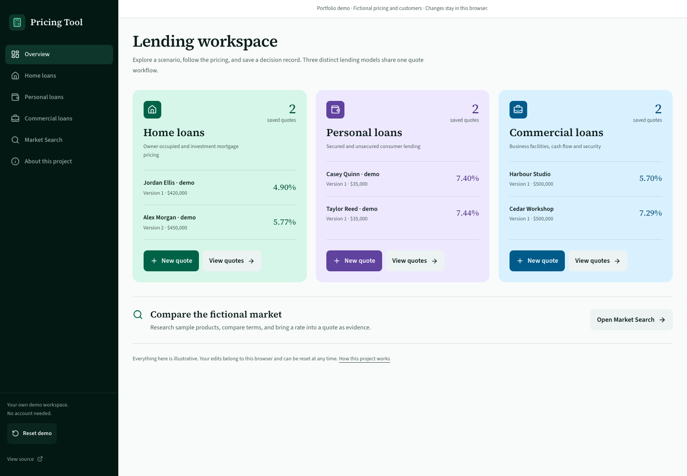

# Pricing Tool

A lending-pricing portfolio project by Alexander Chieng. Explore three distinct calculation engines, inspect the financial reasoning, and work through a saved quote’s review and revision history.

**All products, customers, rates, score calibrations, and policy assumptions are fictional.** The application is a demonstration, not an offer, recommendation, or credit decision. Enter fictional information only.

## Explore the application

- **Home:** owner-occupied and investment scenarios, customer scoring, requested-rate previews, repayments, expected loss, capital and profitability.
- **Personal:** secured and unsecured lending, affordability and customer scoring, repayments and risk-adjusted financial results.
- **Commercial:** term loans, overdrafts, equipment and property facilities, debt-service coverage, security, capital and profitability.
- **Quote workflow:** save, revise, star, assign to a fictional colleague, comment, record reviews, inspect frozen versions, print, and download JSON.
- **Market Search:** compare a fictional catalogue and attach a selected advertised rate as evidence. Comparison rates and fees are display context rather than pricing-policy inputs.

Open a lending area, choose **New quote**, and select **Load sample scenario** to get started. The initial workspace also contains sample requested-rate scenarios and a Home revision history. **Reset demo** restores those examples.



## Architecture

The application uses Next.js, React, TypeScript, Tailwind CSS and Zod. Next.js exports static HTML, JavaScript and styles; Vercel serves the static output. There are no application server endpoints, accounts, authentication, hosted databases, or runtime secrets.

Each lending domain owns its request validation, calculation engine and quote records. Browser adapters supply complete fictional policy bundles and run the full calculation sequence: pricing, risk assessment, exposure at default, expected loss, capital, profitability and policy snapshots. A shared operational record links revisions, workflow, comments and history without combining the three pricing models.

IndexedDB stores structured copies of each quote’s normalised inputs and complete calculation result. Historical pricing is never recalculated from current policy. Revisions and workflow updates use transactions; stale revisions and stale review attempts are rejected. The sample dataset is created independently in each browser.

This portfolio version demonstrates the pricing and operational interface. Multi-user access control, centrally governed publication, production database auditing and live market ingestion are outside this demo.

## Run locally

Use Node.js 22.12 or later within Node 22 or 24.

```bash
npm ci
npm run dev
```

No environment variables or database setup are required. To serve the deployable version:

```bash
npm run build
npm start
```

The static server listens at `http://127.0.0.1:4173`.

## Verify

```bash
npm run typecheck
npm run lint
npm test
npx playwright install chromium
npm run test:e2e
npm run check:sanitisation
```

The browser harness builds and serves the static export in isolated browser contexts. It does not start or connect to a database. Browser checks cover desktop and mobile behaviour; unit tests cover financial invariants, immutable snapshots, revision concurrency, storage failures and review completeness.

To verify a deployed public site, explicitly set its HTTPS origin:

```bash
DEMO_TEST_BASE_URL=https://your-public-demo.example npm run test:e2e -- tests/e2e/production-smoke.spec.ts
```

This opt-in mode skips the local build and static server. Use the stable public domain without a path, credentials, query or fragment. Each desktop and mobile test starts with empty browser storage and no saved sign-in session. The production smoke test calculates, saves, revises and reviews a fictional Home quote, checks that version 1 remains unchanged, and fails on API calls, writes or external network requests. All quote and review changes occur only in the test browser. Without `DEMO_TEST_BASE_URL`, the harness continues to build and test the local static export.

## Browser data

Changes stay within this site’s origin in the browser profile where they were made. Other visitors do not see them. Sharing a quote URL does not share its saved data. Clearing site data or changing domains removes access to that browser’s workspace; JSON downloads can preserve a readable copy, but this demo does not import them.

If browser storage is unavailable, the application explains the failure rather than pretending a quote was saved. Reset removes only Pricing Tool’s local records. The application does not send entered scenarios to analytics or an API.

## Deployment

Import this repository into a new personal Vercel project. Use the **Other** application preset, `npm run build`, the `out` output directory, and the production branch `main`. The checked-in `framework: null` selects that static preset; Next.js is used to generate the site at build time. The repository’s Vercel configuration supplies static routing and response headers. No integrations or environment variables are required.

Share the stable production domain, which must be accessible without signing in. Preview deployments may retain Vercel’s own protection. The local static build is portable to other static hosts.

The source is published for portfolio review. No additional open-source licence is granted by this repository.
